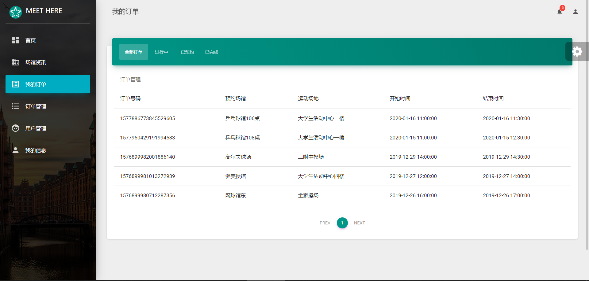

# Meethere_Doc

> 软件测试期末项目前端及展示代码仓库，
> 完成于2019年末，2020年初。

## 项目导航

+ 需求、测试等（报告）文档汇总仓库见[Meethere_Doc](https://github.com/LEODPEN/Meethere_Doc)。

+ 后端及测试代码仓库见[Meethere_Backend](https://github.com/Onion12138/Meet)。

+ [本仓库](https://github.com/TimGin117/MeetHereFront)为前端代码。

## 前端工具与技术选用

+ `Visual Studio Code` 1.41.1

+ `react` (基于 `material-kit-react` 和 `material-dashboard-react` 两个模板)


## 项目成品截图

<div align=center></div>

<div align=center></div>

<div align=center></div>

<div align=center></div>

<div align=center></div>

<div align=center></div>

> 三分钟录屏见`Meethere_Doc`仓库。

## 前端开发代码结构
```
.
├── assets
│   ├── css
│   │   └── material-dashboard-react.css
│   ├── github
│   │   ├── angular.png
│   │   ├── chrome.png
│   │   ├── dashboard.jpg
│   │   ├── edge.png
│   │   ├── firefox.png
│   │   ├── html.png
│   │   ├── map.jpg
│   │   ├── md-react.gif
│   │   ├── notifications.jpg
│   │   ├── opera.png
│   │   ├── opt_md_angular_thumbnail.jpg
│   │   ├── opt_md_thumbnail.jpg
│   │   ├── opt_md_vue_thumbnail.jpg
│   │   ├── opt_mdr_thumbnail.jpg
│   │   ├── react.svg
│   │   ├── safari.png
│   │   ├── tables.jpg
│   │   ├── userprofile.jpg
│   │   └── vuejs.png
│   ├── img
│   │   ├── apple-icon.png
│   │   ├── bg.jpg
│   │   ├── bg2.jpg
│   │   ├── bg3.jpg
│   │   ├── bg4.jpg
│   │   ├── bg7.jpg
│   │   ├── bg8.jpg
│   │   ├── cover.jpeg
│   │   ├── faces
│   │   │   └── marc.jpg
│   │   ├── favicon.png
│   │   ├── mask.png
│   │   ├── new_logo.png
│   │   ├── reactlogo.png
│   │   ├── sidebar-1.jpg
│   │   ├── sidebar-2.jpg
│   │   ├── sidebar-3.jpg
│   │   ├── sidebar-4.jpg
│   │   └── tim_80x80.png
│   └── jss
│       ├── material-dashboard-react
│       │   ├── cardImagesStyles.js
│       │   ├── checkboxAdnRadioStyle.js
│       │   ├── components
│       │   │   ├── buttonStyle.js
│       │   │   ├── cardAvatarStyle.js
│       │   │   ├── cardBodyStyle.js
│       │   │   ├── cardFooterStyle.js
│       │   │   ├── cardHeaderStyle.js
│       │   │   ├── cardIconStyle.js
│       │   │   ├── cardStyle.js
│       │   │   ├── customInputStyle.js
│       │   │   ├── customTabsStyle.js
│       │   │   ├── footerStyle.js
│       │   │   ├── headerLinksStyle.js
│       │   │   ├── headerStyle.js
│       │   │   ├── sidebarStyle.js
│       │   │   ├── snackbarContentStyle.js
│       │   │   ├── tableStyle.js
│       │   │   ├── tasksStyle.js
│       │   │   └── typographyStyle.js
│       │   ├── dropdownStyle.js
│       │   ├── layouts
│       │   │   └── adminStyle.js
│       │   ├── tooltipStyle.js
│       │   └── views
│       │       ├── dashboardStyle.js
│       │       ├── iconsStyle.js
│       │       └── rtlStyle.js
│       ├── material-dashboard-react.js
│       ├── material-kit-react
│       │   ├── components
│       │   │   ├── badgeStyle.js
│       │   │   ├── buttonStyle.js
│       │   │   ├── cardBodyStyle.js
│       │   │   ├── cardFooterStyle.js
│       │   │   ├── cardHeaderStyle.js
│       │   │   ├── cardStyle.js
│       │   │   ├── customDropdownStyle.js
│       │   │   ├── customInputStyle.js
│       │   │   ├── customLinearProgressStyle.js
│       │   │   ├── customTabsStyle.js
│       │   │   ├── footerStyle.js
│       │   │   ├── headerLinksStyle.js
│       │   │   ├── headerStyle.js
│       │   │   ├── infoStyle.js
│       │   │   ├── navPillsStyle.js
│       │   │   ├── paginationStyle.js
│       │   │   ├── parallaxStyle.js
│       │   │   ├── snackbarContentStyle.js
│       │   │   └── typographyStyle.js
│       │   ├── customCheckboxRadioSwitch.js
│       │   ├── imagesStyles.js
│       │   ├── modalStyle.js
│       │   ├── popoverStyles.js
│       │   ├── tooltipsStyle.js
│       │   └── views
│       │       ├── components.js
│       │       ├── componentsSections
│       │       │   ├── basicsStyle.js
│       │       │   ├── carouselStyle.js
│       │       │   ├── completedStyle.js
│       │       │   ├── downloadStyle.js
│       │       │   ├── exampleStyle.js
│       │       │   ├── javascriptStyles.js
│       │       │   ├── loginStyle.js
│       │       │   ├── navbarsStyle.js
│       │       │   ├── notificationsStyles.js
│       │       │   ├── pillsStyle.js
│       │       │   ├── tabsStyle.js
│       │       │   └── typographyStyle.js
│       │       ├── landingPage.js
│       │       ├── landingPageSections
│       │       │   ├── productStyle.js
│       │       │   ├── teamStyle.js
│       │       │   └── workStyle.js
│       │       ├── loginPage.js
│       │       └── profilePage.js
│       ├── material-kit-react.js
│       └── scss
│           ├── core
│           │   ├── _misc.scss
│           │   ├── _mixins.scss
│           │   ├── _variables.scss
│           │   ├── mixins
│           │   │   └── _colored-shadows.scss
│           │   └── variables
│           │       ├── _bootstrap-material-design-base.scss
│           │       ├── _bootstrap-material-design.scss
│           │       ├── _brand.scss
│           │       ├── _colors-map.scss
│           │       ├── _colors.scss
│           │       ├── _functions.scss
│           │       ├── _shadow.scss
│           │       └── _variables.scss
│           ├── material-kit-react.scss
│           └── plugins
│               ├── _plugin-nouislider.scss
│               ├── _plugin-react-datetime.scss
│               └── _plugin-react-slick.scss
├── axiosSetting.js
├── components
│   ├── AuthRoute
│   │   └── AuthRoute.js
│   ├── Card
│   │   ├── Card.js
│   │   ├── CardAvatar.js
│   │   ├── CardBody.js
│   │   ├── CardFooter.js
│   │   ├── CardHeader.js
│   │   └── CardIcon.js
│   ├── CustomButtons
│   │   └── Button.js
│   ├── CustomDialog
│   │   └── CustomDialog.js
│   ├── CustomInput
│   │   └── CustomInput.js
│   ├── CustomTabs
│   │   └── CustomTabs.js
│   ├── FixedPlugin
│   │   └── FixedPlugin.js
│   ├── Footer
│   │   └── Footer.js
│   ├── Grid
│   │   ├── GridContainer.js
│   │   └── GridItem.js
│   ├── Header
│   │   ├── Header.js
│   │   └── HeaderLinks.js
│   ├── NavPills
│   │   └── NavPills.js
│   ├── Navbars
│   │   ├── AdminNavbarLinks.js
│   │   └── Navbar.js
│   ├── Pagination
│   │   └── Pagination.js
│   ├── Sidebar
│   │   └── Sidebar.js
│   ├── Snackbar
│   │   ├── Snackbar.js
│   │   └── SnackbarContent.js
│   ├── Table
│   │   └── Table.js
│   ├── Tasks
│   │   └── Tasks.js
│   └── Typography
│       ├── Danger.js
│       ├── Info.js
│       ├── Muted.js
│       ├── Primary.js
│       ├── Quote.js
│       ├── Success.js
│       └── Warning.js
├── index.js
├── layouts
│   └── BasicLayout.js
├── logo.svg
├── routes.js
├── setupProxy.js
├── utils
│   ├── defaultUtils.js
│   ├── fileURL.js
│   └── timeUtils.js
├── variables
│   ├── charts.js
│   └── general.js
└── views
    ├── Dashboard
    │   ├── Dashboard.js
    │   └── NewsDisplay.js
    ├── GymInfo
    │   └── GymInfo.js
    ├── LoginPage
    │   └── LoginPage.js
    ├── OrderInfo
    │   ├── AllOrder.js
    │   ├── CurrentOrder.js
    │   ├── FutureOrder.js
    │   ├── OrderInfo.js
    │   └── PastOrder.js
    ├── OrderManagement
    │   ├── AllOrder.js
    │   ├── CurrentOrder.js
    │   ├── FutureOrder.js
    │   ├── OrderManagement.js
    │   └── PastOrder.js
    ├── RegisterPage
    │   └── RegisterPage.js
    ├── UserManagement
    │   └── UserManagement.js
    └── UserProfile
        └── UserProfile.js
```

## 其他

+ 如有其他问题请于`issues`提出或与此仓库拥有者联系。
